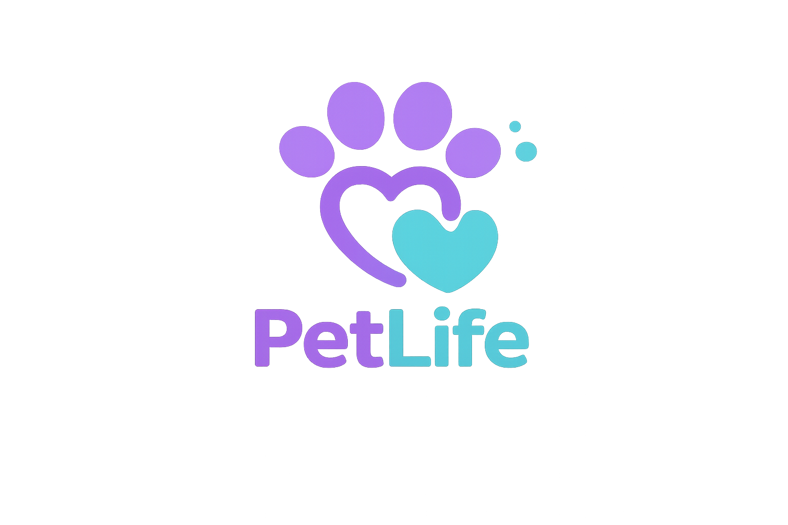
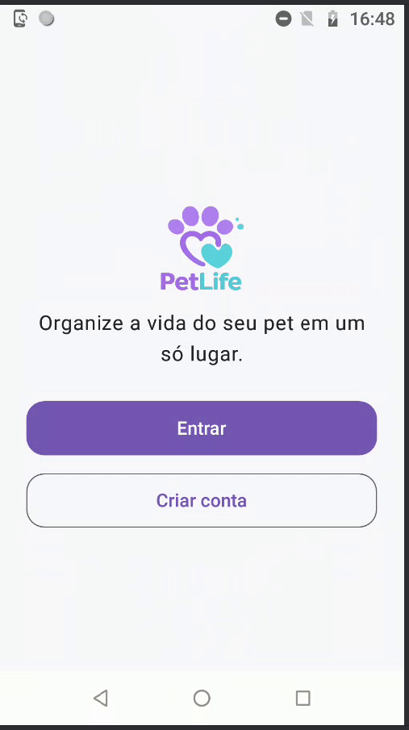
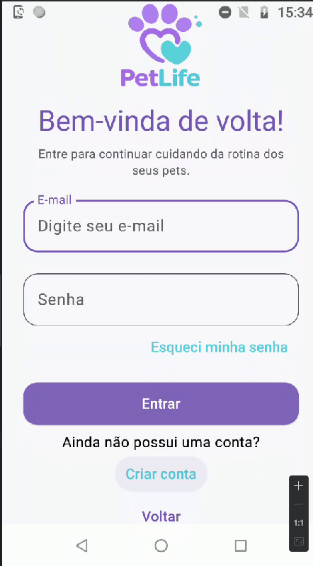
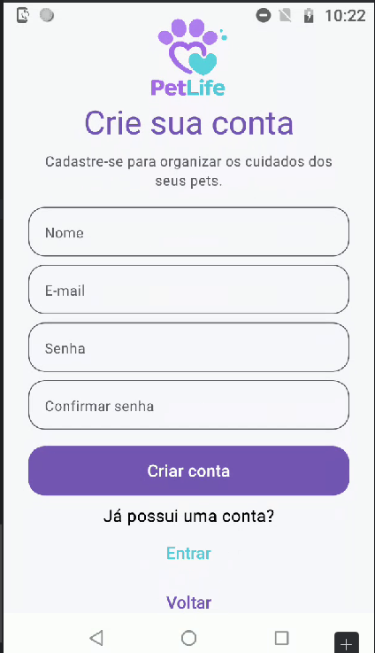
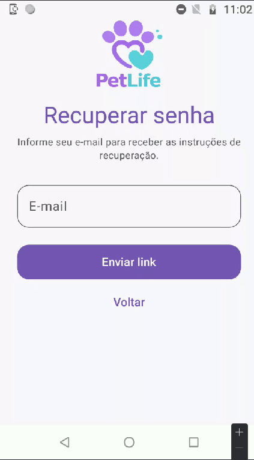
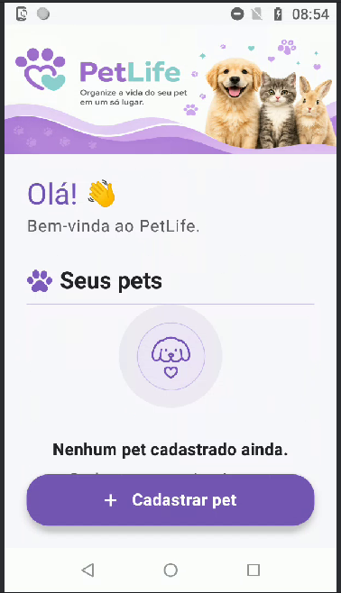
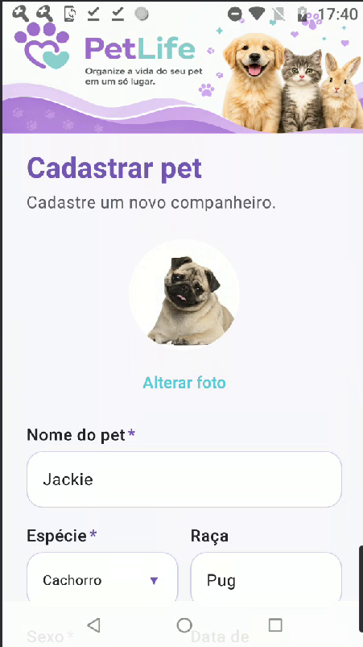

<p align="center">
  
</p>

<h1 align="center">PetLife</h1>

<p align="center">
Organize a vida do seu pet em um só lugar.
</p>

<p align="center">


</p>

---

## 📱 Sobre o projeto

O **PetLife** é um aplicativo Android desenvolvido em **Kotlin** para auxiliar tutores na organização da rotina, saúde e bem-estar de seus animais de estimação.

O projeto está sendo desenvolvido como parte do meu portfólio profissional, seguindo boas práticas de desenvolvimento Android, arquitetura limpa e documentação contínua durante todas as etapas de evolução da aplicação.

---

## 🚧 Status do projeto

Projeto em desenvolvimento ativo.

---

## 🎯 Objetivo

O PetLife tem como objetivo auxiliar tutores no gerenciamento das informações e dos cuidados dos seus animais de estimação.

O aplicativo permitirá registrar pets, consultas, vacinas, banhos, medicamentos e outros compromissos relacionados à saúde e à rotina dos animais.

---

## ✨ Funcionalidades implementadas

- 🔐 Fluxo de autenticação e navegação entre telas
- 🏠 Home inicial do aplicativo
- 🐶 Cadastro de pets com formulário estruturado
- 🐾 Seleção de espécie e sexo
- 📅 Seleção de data de nascimento com Date Picker
- 📷 Seleção de foto do pet pela galeria
- 🖼️ Pré-visualização da foto selecionada
- ✅ Validação dos campos obrigatórios

---

## 🚀 Funcionalidades planejadas

- 👤 Autenticação de usuários com Firebase
- 🐶 Persistência e gerenciamento de pets
- 📅 Agenda de consultas e cuidados
- 💉 Controle de vacinas
- 💊 Registro de medicamentos
- ⚖️ Registro de peso e informações de saúde
- 💾 Persistência local com Room
- 🌐 Consumo de API REST
- 📍 Consulta automática de endereço por CEP
- 📴 Funcionamento offline
- 📊 Dashboard com próximos compromissos
- 
---

## 🛠 Tecnologias

- Kotlin
- Jetpack Compose
- Material Design 3
- MVVM
- Room
- Retrofit
- Hilt
- Coroutines
- Flow / StateFlow
- Firebase Authentication
- Navigation Compose
- JUnit

---

## 🏛 Arquitetura

O projeto será desenvolvido utilizando uma arquitetura em camadas.

### Camada de Interface (UI)

Responsável pelas telas, componentes visuais, gerenciamento de estados e interação com o usuário.

### Camada de Dados (Data)

Responsável pelo acesso ao banco de dados local, consumo de APIs e implementação dos repositórios.

### Camada de Domínio (Domain)

Será adicionada quando houver regras de negócio reutilizáveis ou suficientemente complexas para justificar sua separação.

---

## 📂 Estrutura do projeto

```
PetLife
│
├── app
│   ├── core
│   ├── feature
│   ├── ui
│   └── ...
│
├── docs
│   ├── adr
│   └── design
│
├── assets
│   ├── logo
│   ├── banner
│   └── screenshots
│
└── README.md
```

---

## 📸 Screenshots

<a href="assets/screenshots/welcome-screen.png">
    
  </a> |
  <a href="assets/screenshots/login-screen.png">
    
  </a> |
  <a href="assets/screenshots/register-screen.png">
    
  </a> |
  <a href="assets/screenshots/forgot-password-screen.png">
    
  </a> |
  <a href="assets/screenshots/home-screen.png">
    
  </a> |
   <a href="assets/screenshots/add-pet-screen.png">
  
</a>
---

## ⚙️ Requisitos

- Android 8.0 (API 26) ou superior
- Kotlin
- Jetpack Compose

---

## 💻 Ambiente de desenvolvimento

- Ubuntu 24.04 LTS
- Android Studio Ladybug Feature Drop
- Java 21
- Dispositivo físico Android (API 27+)

---

## 📖 Histórico do projeto

- ✅ Configuração do ambiente de desenvolvimento Android
- ✅ Atualização do Java para a versão 21
- ✅ Ajuste de compatibilidade entre AndroidX, compileSdk e Android Gradle
- ✅ Configuração do Git e integração com GitHub
- ✅ Execução do aplicativo em dispositivo físico
- ✅ Organização da arquitetura baseada em Feature Packages
- ✅ Criação do Design System do PetLife
- ✅ Definição da identidade visual (paleta, logomarca e componentes)
- ✅ Implementação do fluxo completo de autenticação
- ✅ Implementação da Home inicial com identidade visual personalizada

---

## 📚 Documentação

Toda a evolução do projeto está sendo documentada durante o desenvolvimento.

- `CHANGELOG.md` — Histórico das alterações realizadas.
- `docs/adr/` — Registros de decisões arquiteturais (Architecture Decision Records).
- `docs/design/` — Documentação do Design System.

---

<h2>
    
    Desenvolvedora
</h2>

**Daniella Rodrigues**

Desenvolvedora Android • Kotlin • Jetpack Compose

Desenvolvido como projeto de estudo e portfólio para demonstrar conhecimentos em desenvolvimento Android moderno utilizando Kotlin e Jetpack Compose.